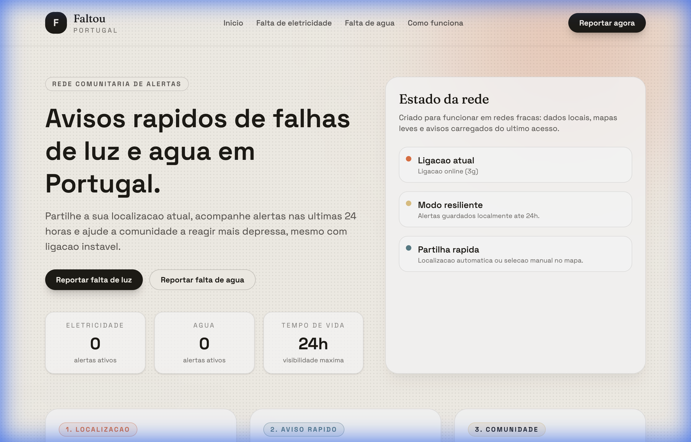

# Faltou 💡🚰

**Faltou** is a community-driven platform for reporting and tracking power and water outages across Portugal. Built with speed, resilience, and simplicity in mind, it helps communities react faster to service disruptions even in areas with unstable connectivity.



## 📌 Features

- **Quick Reports**: Easily report electricity or water outages with just a few clicks.
- **Real-time Map**: Visualize active incidents across the country.
- **24-Hour Lifecycle**: Alerts are automatically archived after 24 hours to ensure the data remains fresh and relevant.
- **Connection Resilience**: Designed to work under poor network conditions using local caching and lightweight map implementations.
- **Privacy First**: No mandatory registration. Share only what's necessary to help others.

## 🛠️ Tech Stack

- **Framework**: [Laravel 12](https://laravel.com)
- **Styling**: [Tailwind CSS v4](https://tailwindcss.com)
- **Frontend Tooling**: [Vite](https://vitejs.dev)
- **Testing**: [Pest PHP](https://pestphp.com)
- **Deployment**: Optimized for standard PHP/Laravel environments.

## 🚀 Getting Started

### Prerequisites

- PHP 8.2 or higher
- Composer
- Node.js & NPM

### Installation

1. **Clone the repository**:
   ```bash
   git clone https://github.com/your-username/faltou.git
   cd faltou
   ```

2. **Run the setup script**:
   The project includes a convenient setup script that handles composer installation, environment configuration, key generation, migrations, and asset building.
   ```bash
   composer run setup
   ```

3. **Start the development servers**:
   ```bash
   composer run dev
   ```

## 📖 Development Commands

- `composer run dev`: Starts all necessary services (Vite, Laravel server, queue listener, logs).
- `composer run test`: Runs the Pest test suite.
- `npm run build`: Compiles assets for production.

## 🇵🇹 Sobre o Projeto (PT-PT)

O **Faltou** é uma rede comunitária de alertas de falhas de luz e água em Portugal. 

### Como funciona?
1. **Localização**: Autorize o GPS ou marque manualmente no mapa.
2. **Aviso Rápido**: Partilhe o que faltou (eletricidade ou água).
3. **Comunidade**: Os alertas ficam visíveis durante 24 horas para dar contexto a quem está por perto.

Criado para funcionar em redes fracas, o sistema utiliza dados locais e mapas leves para garantir que a informação chega a quem precisa, mesmo em situações críticas.

## 📄 License

This project is open-sourced software licensed under the [MIT license](LICENSE).
